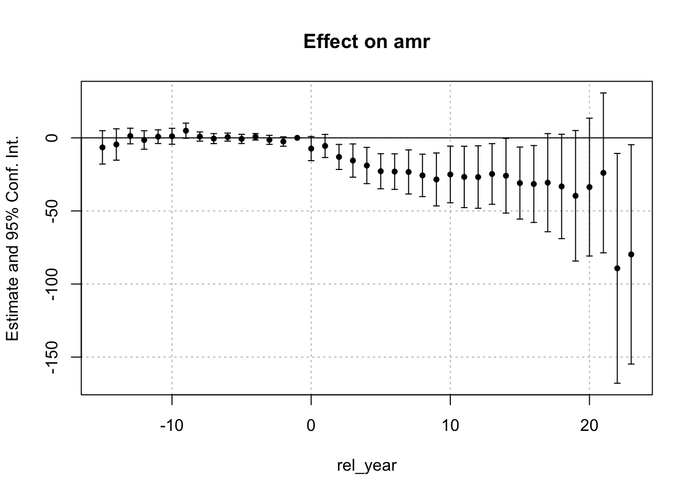
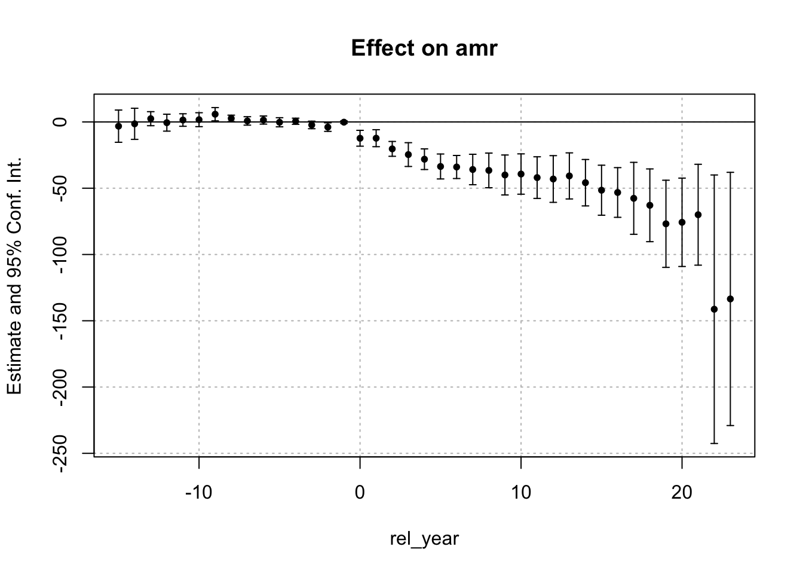
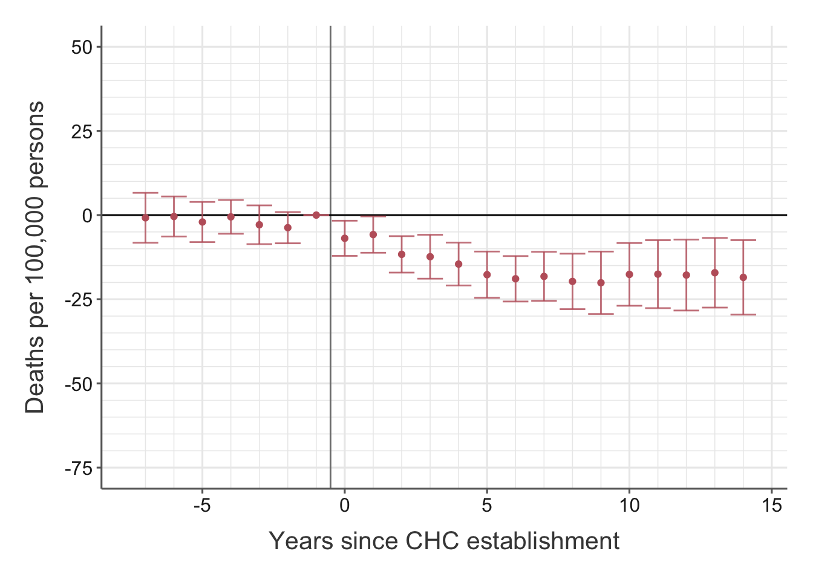
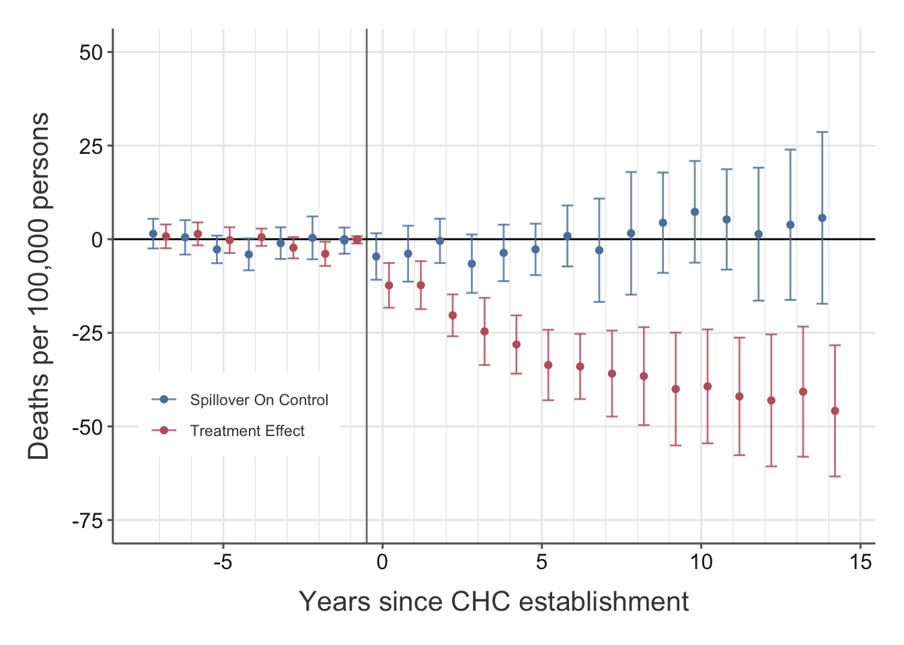

Replication of Bailey and Goodman-Bacon (2015) with extension for event study framework including spillover effect controls.


::: {.cell}

```{.r .cell-code}
library(tidyverse, warn.conflicts = FALSE)
library(sf)
library(kfbmisc)
library(fixest)
library(did2s, quietly = TRUE)

slides <- TRUE
h_w_ratio <- 9 / 16
```
:::


## Data Cleaning 


::: {.cell}

```{.r .cell-code}
df <- haven::read_dta(here::here("data/chc/aer_data.dta")) |>
  # Remove LA, New York, Chicago
  filter(
    !(stfips == 36 & cofips == 61) &
      !(stfips == 6 & cofips == 37) &
      !(stfips == 17 & cofips == 31)
  ) |>
  # Create urban dummy
  group_by(fips) |>
  mutate(
    `_urb` = sum(`_60pcturban` * (year == 1960), na.rm = TRUE)
  ) |>
  ungroup() |>
  # cut every 25% with indicator from 0
  mutate(
    Durb = Hmisc::cut2(`_urb`, cuts = c(0, 1, 24.999, 49.999, 74.999, 110))
  ) |>
  replace_na(list(chc_year_exp = 0))

ctr_pop <- read_sf(here::here("data/2010_centpop/")) |>
  mutate(fips = as.numeric(paste0(STATEFP, COUNTYFP))) |>
  select(fips) |>
  arrange(fips) |>
  st_transform(st_crs(2163))

df <- df |>
  filter(fips != 12025) |>
  left_join(ctr_pop, by = "fips") |>
  st_as_sf()
```
:::


## Create Spillover variables 


::: {.cell}

```{.r .cell-code}
## helper function: for each year, calculate within
within_x_treat <- function(dist, year, chc_year_exp, geometry) {
  y <- min(year)

  # Last term is because Bailey and Goodman-Bacon define it for chc's before 1974
  treated <- (chc_year_exp <= y) & (chc_year_exp > 0) & (chc_year_exp <= 1974)


  dist_mat <- st_distance(geometry, geometry) |>
    units::set_units("mi") |>
    units::drop_units()

  within <- (dist_mat > 0) & (dist_mat < dist)

  return(as.numeric((within %*% treated) > 0))
}
```
:::

::: {.cell}

```{.r .cell-code}
## helper function: find minimum year that within == 1, requires sorted!
min_year <- function(year, within) {
  if (any(within == 1)) {
    idx <- which(within == 1)[1]
    y <- year[idx]
  } else {
    y <- 0
  }

  return(y)
}
```
:::

::: {.cell}

```{.r .cell-code}
df_spill <- df |>
  group_by(year) |>
  filter(year <= 1988) |>
  # Create within indicator
  mutate(
    # CHC is included if added up to 1974
    # Definition from Bailey and Goodman-Bacon
    chc_open = if_else(chc_year_exp <= 1974, chc_year_exp, 0),
    # Create D_it
    treat = as.numeric((chc_year_exp <= year) & (chc_year_exp != 0)),
    # Create S_it
    within_25 = within_x_treat(25, year, chc_year_exp, geometry),
    # S_it (1 - D_it)
    within_25 = within_25 * (1 - treat)
  ) |>
  ungroup() |>
  # Arrange panel by fips year
  arrange(fips, year) |>
  group_by(fips) |>
  mutate(
    # Create D_it^k's
    rel_year = case_when(
      chc_year_exp == 0 ~ -1,
      chc_year_exp >= 1975 ~ -1,
      TRUE ~ year - chc_year_exp
    ),
    # Minimum year where S_it = 1
    year_within_25 = min_year(year, within_25),
    # Create S_it^k
    spill_rel_year = case_when(
      year_within_25 == 0 ~ -Inf,
      treat == 1 ~ -Inf,
      TRUE ~ year - year_within_25
    ),
    # max(D_it, S_it)
    treat_or_spill = treat + within_25,
    # Create trend variables for controls
    Durb_trend = as.factor(paste(year, Durb, sep = "_")),
    Durb_trend = as.factor(as.numeric(Durb_trend)),
    stfips_trend = as.factor(paste(year, stfips, sep = "_")),
    stfips_trend = as.factor(as.numeric(stfips_trend)),
  ) |>
  ungroup()
```
:::


## Replicate Event Study 


::: {.cell}

```{.r .cell-code}
es_pts <- df |>
  filter(year <= 1988) |>
  st_drop_geometry() |>
  fixest::feols(
    amr ~ i(exp1, ref = -1) + D_tot_act_md_t + D_60pctnonwhit_t + D_60pctrurf_t + D_60pcturban_t + D_pct59inclt3k_t + R_tranpcret + R_tranpcpa1 + H_bpc + H_hpc | fips + year + year^Durb + year^stfips,
    weights = ~popwt
  ) |>
  broom::tidy() |>
  filter(stringr::str_detect(term, "exp1::")) |>
  mutate(
    time = as.numeric(stringr::str_remove(term, "exp1::"))
  ) |>
  select(time, estimate, std.error) |>
  add_row(tibble(time = -1, estimate = 0, std.error = 0)) |>
  mutate(
    ub = estimate + 1.96 * std.error,
    lb = estimate - 1.96 * std.error
  ) |>
  filter(time <= 14)
```

::: {.cell-output .cell-output-stderr}

```
NOTE: 540 observations removed because of NA values (LHS: 90, RHS: 540, Weights: 90).
```


:::
:::


## Modern Event Study 


::: {.cell}

```{.r .cell-code}
# No spillover control, but modern estimator
es_1 <- df_spill |>
  sf::st_drop_geometry() |>
  drop_na(D_tot_act_md_t, D_60pctnonwhit_t, D_60pctrurf_t, D_60pcturban_t, D_pct59inclt3k_t, R_tranpcret, R_tranpcpa1, H_bpc, H_hpc, Durb_trend) |>
  did2s::did2s(
    yname = "amr",
    first_stage = ~ D_tot_act_md_t + D_60pctnonwhit_t + D_60pctrurf_t + D_60pcturban_t + D_pct59inclt3k_t + R_tranpcret + R_tranpcpa1 + H_bpc + H_hpc | fips + year + Durb_trend + stfips_trend,
    second_stage = ~ i(rel_year, ref = -1),
    treatment = "treat",
    weights = "popwt",
    cluster_var = "stfips"
  )
```

::: {.cell-output .cell-output-stderr}

```
Running Two-stage Difference-in-Differences
 - first stage formula `~ D_tot_act_md_t + D_60pctnonwhit_t + D_60pctrurf_t + D_60pcturban_t + D_pct59inclt3k_t + R_tranpcret + R_tranpcpa1 + H_bpc + H_hpc | fips + year + Durb_trend + stfips_trend`
 - second stage formula `~ i(rel_year, ref = -1)`
 - The indicator variable that denotes when treatment is on is `treat`
 - Standard errors will be clustered by `stfips`
```


:::

::: {.cell-output .cell-output-stderr}

```
NOTE: The fixed-effects are not regular, they cannot be straightforwardly interpreted.
```


:::

```{.r .cell-code}
# Preview es result
iplot(es_1)
```

::: {.cell-output-display}
{width=672}
:::
:::

::: {.cell}

```{.r .cell-code}
# Spillover controls
es_2 <- did2s::did2s(
  data = df_spill |>
    sf::st_drop_geometry() |>
    # Filter out NAs
    drop_na(D_tot_act_md_t, D_60pctnonwhit_t, D_60pctrurf_t, D_60pcturban_t, D_pct59inclt3k_t, R_tranpcret, R_tranpcpa1, H_bpc, H_hpc, Durb_trend, stfips_trend),
  yname = "amr",
  first_stage = ~ D_tot_act_md_t + D_60pctnonwhit_t + D_60pctrurf_t + D_60pcturban_t + D_pct59inclt3k_t + R_tranpcret + R_tranpcpa1 + H_bpc + H_hpc | fips + year + Durb_trend + stfips_trend,
  second_stage = ~ i(rel_year) + i(spill_rel_year, ref = -Inf),
  treatment = "treat_or_spill",
  weights = "popwt",
  cluster_var = "stfips"
)
```

::: {.cell-output .cell-output-stderr}

```
Running Two-stage Difference-in-Differences
 - first stage formula `~ D_tot_act_md_t + D_60pctnonwhit_t + D_60pctrurf_t + D_60pcturban_t + D_pct59inclt3k_t + R_tranpcret + R_tranpcpa1 + H_bpc + H_hpc | fips + year + Durb_trend + stfips_trend`
 - second stage formula `~ i(rel_year) + i(spill_rel_year, ref = -Inf)`
 - The indicator variable that denotes when treatment is on is `treat_or_spill`
 - Standard errors will be clustered by `stfips`
```


:::

::: {.cell-output .cell-output-stderr}

```
NOTE: The fixed-effects are not regular, they cannot be straightforwardly interpreted.
```


:::

```{.r .cell-code}
iplot(es_2)
```

::: {.cell-output-display}
{width=672}
:::
:::

::: {.cell}

```{.r .cell-code}
es_pts_combined <- broom::tidy(es_2) |>
  mutate(
    # Split term to variable and relative time
    term_split = str_split(term, "::"),
    term = unlist(lapply(term_split, \(x) x[1])),
    time = unlist(lapply(term_split, \(x) x[2])),
    time = as.numeric(time),
    # Confidence interval
    ub = estimate + 1.96 * std.error,
    lb = estimate - 1.96 * std.error,
    # Term for plotting
    group = case_when(
      term == "rel_year" ~ "Treatment Effect",
      term == "spill_rel_year" ~ "Spillover On Control",
    )
  ) |>
  # Filter years to match original
  filter(time <= 14 & time >= -7) |>
  # Shift for plotting
  mutate(time = if_else(term == "rel_year", time + 0.2, time - 0.2))

# Add -1 for plotting
es_pts_combined <- bind_rows(
  es_pts_combined,
  tibble(time = c(-1.2, -0.8), estimate = c(0, 0), ub = c(0, 0), lb = c(0, 0), group = c("Spillover On Control", "Treatment Effect"))
)
```
:::


## Export figures 


::: {.cell}

```{.r .cell-code}
# treatment effect original
(es_plot_original <- ggplot(es_pts) +
  geom_vline(xintercept = -0.5, color = "grey50") +
  geom_hline(yintercept = 0, color = "black") +
  geom_point(aes(x = time, y = estimate), color = "#bf616a") +
  geom_errorbar(aes(x = time, ymin = lb, ymax = ub), color = "#bf616a", alpha = 0.8) +
  theme_kyle(base_size = 12) +
  theme(title = element_text(size = 12, margin = margin(b = 0, unit = "pt"))) +
  scale_x_continuous(minor_breaks = seq(-7, 14, 1)) +
  scale_y_continuous(minor_breaks = seq(-75, 50, 5), limits = c(-75, 50)) +
  labs(y = "Deaths per 100,000 persons", x = "Years since CHC establishment", color = NULL))
```

::: {.cell-output-display}
{width=672}
:::

```{.r .cell-code}
kfbmisc::tikzsave(
  here::here("figures/chc/chc-es_original_slides.pdf"), 
  es_plot_original, width = 8, height = 8 * h_w_ratio
)
kfbmisc::tikzsave(
  here::here("figures/chc/chc-es_original.pdf"), 
  es_plot_original, width = 8, height = 5
)
```
:::

::: {.cell}

```{.r .cell-code}
(es_plot_combined <- ggplot(es_pts_combined) +
  geom_vline(xintercept = -0.5, color = "grey50") +
  geom_hline(yintercept = 0, color = "black") +
  geom_point(aes(x = time, y = estimate, color = group)) +
  geom_errorbar(aes(x = time, ymin = lb, ymax = ub, color = group), alpha = 0.8) +
  kfbmisc::theme_kyle(base_size = 12) +
  theme(
    legend.position = "inside",
    legend.position.inside = c(0.165, 0.25),
    legend.spacing.x = unit(0, "pt"),
    legend.spacing.y = unit(0, "pt"),
    legend.background = element_rect(fill = "white"),
    panel.grid.minor.y = element_blank()
  ) +
  scale_shape_manual(values = c(16, 18)) +
  scale_color_manual(values = c("#5e81ac", "#bf616a")) +
  scale_x_continuous(minor_breaks = seq(-7, 14, 1)) +
  scale_y_continuous(minor_breaks = seq(-75, 45, 50), limits = c(-75, 50)) +
  labs(y = "Deaths per 100,000 persons", x = "Years since CHC establishment", color = NULL))
```

::: {.cell-output-display}
{width=672}
:::
:::

::: {.cell}

```{.r .cell-code}
kfbmisc::tikzsave(
  here::here("figures/chc/chc-es_combined_slides.pdf"),
  es_plot_combined,
  width = 8, height = 8 * h_w_ratio
)
kfbmisc::tikzsave(
  here::here("figures/chc/chc-es_combined.pdf"),
  es_plot_combined,
  width = 8, height = 5
)
```
:::
