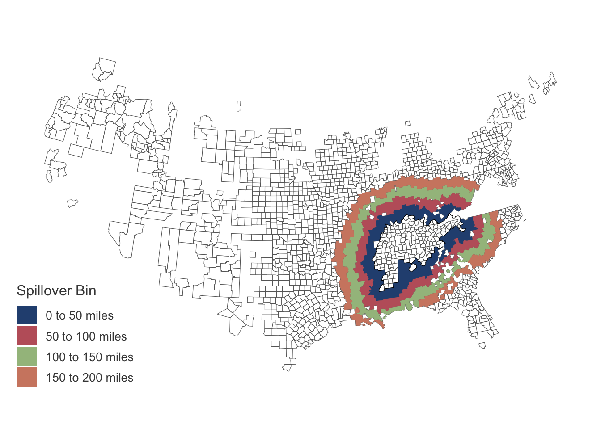

# Kline and Moretti (2014)


Replicate Table 3 of Kline and Moretti (2014) with extension that
includes spillover control using rings method

``` r
library(tidyverse, warn.conflicts = FALSE)
library(fixest)
library(haven)
library(sf)
library(Rcpp)
library(RcppArmadillo)
library(kfbmisc)

# Helper functions
source(here::here("code/TVA/helpers.R"))
source(here::here("code/TVA/helper-conley.R"))
h_w_ratio <- 9 / 16
```

``` r
df <- read_dta(here::here("data/tva/build.dta")) |>
  mutate(
    fips = sprintf("%05d", fipstat * 1000 + fipcnty)
  )

counties <- sf::read_sf(here::here("data/2010_county.geojson")) |>
  mutate(fips = paste0(STATEFP10, COUNTYFP10)) |>
  select(state = STATEFP10, county = COUNTYFP10, fips) |>
  rmapshaper::ms_simplify(keep = 0.05)
```

    The legacy packages maptools, rgdal, and rgeos, underpinning this package
    will retire shortly. Please refer to R-spatial evolution reports on
    https://r-spatial.org/r/2023/05/15/evolution4.html for details.
    This package is now running under evolution status 0 

``` r
# Create TVA shape
tva_fips <- scan(here::here("data/tva/tvacounties.txt"), character())

tva <- counties |>
  filter(fips %in% tva_fips) |>
  summarize()

dist_mat <- st_distance(counties |> st_point_on_surface(), tva)
```

    Warning: st_point_on_surface assumes attributes are constant over geometries

``` r
counties$dist_to_tva <- as.vector(units::drop_units(units::set_units(dist_mat, "mi")))

setFixest_fml(
  ..controls = ~ lnelevmax + lnelevrang + lnarea + lnpop20 + lnpop20sq + lnpop30 + lnpop30sq + popdifsq + agrshr20 + agrshr20sq + agrshr30 + agrshr30sq + manufshr20 + manufshr30 + lnwage20 + lnwage30 + lntwage30 + lnemp20 + lnemp30 + urbshare20 + urbshare30 + lnfaval20 + lnfaval30 + lnmedhsval30 + lnmedrnt30 + white20 + white20sq + white30 + white30sq + pctil20 + pctil30 + urate30 + fbshr20 + fbshr30 + PRADIO30 + nowage20dum + nowage30dum + notwage30dum
)

controls <- c("lnelevmax", "lnelevrang", "lnarea", "lnpop20", "lnpop20sq", "lnpop30", "lnpop30sq", "popdifsq", "agrshr20", "agrshr20sq", "agrshr30", "agrshr30sq", "manufshr20", "manufshr30", "lnwage20", "lnwage30", "lntwage30", "lnemp20", "lnemp30", "urbshare20", "urbshare30", "lnfaval20", "lnfaval30", "lnmedhsval30", "lnmedrnt30", "white20", "white20sq", "white30", "white30sq", "pctil20", "pctil30", "urate30", "fbshr20", "fbshr30", "PRADIO30", "nowage20dum", "nowage30dum", "notwage30dum")
```

Create spillover variables

``` r
# lat-long of county centroids
counties[, c("long", "lat")] <- counties |>
  st_transform(4326) |>
  st_point_on_surface() |>
  st_coordinates()
```

    Warning: st_point_on_surface assumes attributes are constant over geometries

    Warning in st_point_on_surface.sfc(st_geometry(x)): st_point_on_surface may not
    give correct results for longitude/latitude data

``` r
# Create spillover variable donuts
df_reg <- df |>
  left_join(counties |> st_drop_geometry(), by = "fips") |>
  mutate(
    tva_0_100 = !tva & dist_to_tva >= 0 & dist_to_tva < 100,
    tva_0_50 = !tva & dist_to_tva >= 0 & dist_to_tva < 50,
    tva_50_100 = !tva & dist_to_tva >= 50 & dist_to_tva < 100,
    tva_100_150 = !tva & dist_to_tva >= 100 & dist_to_tva < 150,
    tva_150_200 = !tva & dist_to_tva >= 150 & dist_to_tva < 200
  )
```

Logit for subsample

``` r
tva_logit <- fixest::femlm(tva ~ ..controls, data = df_reg, family = "logit")
```

    NOTE: 122 observations removed because of NA values (RHS: 122).

``` r
df_reg <- df_reg |>
  mutate(
    phat = predict(tva_logit, df_reg),
    keep = phat > quantile(phat, probs = c(0.25), na.rm = TRUE)
  )
```

Figure of counties and spillover variable

``` r
fips_in_sample <- df_reg |>
  drop_na(!!c(controls)) |>
  filter(keep == TRUE) |>
  pull(fips)

rings <- counties |>
  filter(fips %in% fips_in_sample) |>
  mutate(
    spill = case_when(
      0 < dist_to_tva & dist_to_tva <= 50 ~ "0 to 50 miles",
      50 < dist_to_tva & dist_to_tva <= 100 ~ "50 to 100 miles",
      100 < dist_to_tva & dist_to_tva <= 150 ~ "100 to 150 miles",
      150 < dist_to_tva & dist_to_tva <= 200 ~ "150 to 200 miles",
    )
  ) |>
  filter(!is.na(spill)) |>
  group_by(spill) |>
  summarize()

rings$spill <- factor(rings$spill, levels = c("0 to 50 miles", "50 to 100 miles", "100 to 150 miles", "150 to 200 miles"))
```

``` r
nord_palette <- c("#295080", "#BF616A", "#A3BE8C", "#D08770")
grey_palette <- c("grey30", "grey50", "grey70")

(spillover_map <- ggplot() +
  geom_sf(
    data = counties |> filter(fips %in% fips_in_sample),
    fill = NA, color = "grey40", size = 0.5
  ) +
  geom_sf(data = rings, aes(fill = spill), color = NA) +
  # Outline of TVA
  geom_sf(data = tva, color = "Black", fill = NA, size = 1.1) +
  coord_sf(datum = NA) +
  scale_fill_manual(values = nord_palette, na.translate = FALSE) +
  theme_kyle(base_size = 14) +
  kfbmisc::theme_map() +
  theme(
    legend.position = "inside",
    legend.position.inside = c(0.1, 0.15)
  ) +
  labs(fill = "Spillover Bin"))
```



``` r
kfbmisc::tikzsave(
  "figures/tva/tva-sample.pdf",
  spillover_map,
  width = 8, height = 4.5
)
kfbmisc::tikzsave(
  "figures/tva/tva-sample_slides.pdf",
  spillover_map,
  width = 8, height = 8 * h_w_ratio
)
```

## Regression

``` r
df_reg <- df_reg |>
  mutate(
    D_lnpop = winsorize_x((lnpop2000 - lnpop40) / 6, 0.01),
    D_lnwage = winsorize_x((lnwage2000 - lnwage40) / 6, 0.01),
    D_lnagr = winsorize_x((lnagr2000 - lnagr40) / 6, 0.01),
    D_lnmanuf = winsorize_x((lnmanuf2000 - lnmanuf40) / 6, 0.01),
    D_lnvfprod = winsorize_x((lnvfprod2000 - lnvfprod40) / 6, 0.01),
    D_lnmedfaminc = winsorize_x((lnmedfaminc2000 - lnmedfaminc50) / 5, 0.01),
    D_lnfaval = winsorize_x((lnfaval2000 - lnfaval40) / 6, 0.01),
    D_lnpop_short = winsorize_x((lnpop60 - lnpop40) / 2, 0.01),
    D_lnwage_short = winsorize_x((lnwage60 - lnwage40) / 2, 0.01),
    D_lnagr_short = winsorize_x((lnagr60 - lnagr40) / 2, 0.01),
    D_lnmanuf_short = winsorize_x((lnmanuf60 - lnmanuf40) / 2, 0.01),
    D_lnvfprod_short = winsorize_x((lnvfprod60 - lnvfprod40) / 2, 0.01),
    D_lnmedfaminc_short = winsorize_x((lnmedfaminc60 - lnmedfaminc50) / 1, 0.01),
    D_lnfaval_short = winsorize_x((lnfaval60 - lnfaval40) / 2, 0.01)
  )
```

### 1940-2000

``` r
dep_names <- c(
  "Agricultural employment" = "D_lnagr",
  "Manufacturing employment" = "D_lnmanuf"
)
table_tex <- ""

for (y in dep_names) {
  outcome_name <- names(dep_names[dep_names == y])
  cli::cli_h2("{outcome_name}")

  temp <- df_reg |>
    # Drop NAs from data
    drop_na(!!c(controls, y, "tva_0_100")) |>
    filter(keep == 1)

  # Diff-in-Diff with Controls -----------------------------------------------
  formula_controls <- as.formula(paste0(y, " ~ tva + ", paste(controls, collapse = " + ")))
  reg_controls <- fixest::feols(formula_controls, data = temp, demeaned = TRUE)

  X <- reg_controls$X_demeaned
  e <- reg_controls$residuals
  coords <- as.matrix(temp[, c("lat", "long")])
  # 1 mi = 1.60934 km
  dist_cutoff <- 200 * 1.60934

  cov_controls <- conley_ses(X, e, coords, dist_cutoff)$Spatial

  # Diff-in-Diff with Spillovers ---------------------------------------------
  formula_controls_spill <- as.formula(paste0(y, " ~ tva + tva_0_50 + tva_50_100 + tva_100_150 + tva_150_200 + ", paste(controls, collapse = " + ")))
  reg_spill <- fixest::feols(formula_controls_spill, data = temp, demeaned = TRUE)

  X <- reg_spill$X_demeaned
  e <- reg_spill$residuals
  coords <- as.matrix(temp[, c("lat", "long")])
  # 1 mi = 1.60934 km
  dist_cutoff <- 200 * 1.60934

  cov_spill <- conley_ses(X, e, coords, dist_cutoff)$Spatial


  # Create row
  row <- ""
  row_se <- ""

  # Outcome Variable
  row <- paste0(row, str_pad(outcome_name, 28, "right"), "& ")
  row_se <- paste0(row_se, str_pad("", 28, "right"), "& ")


  # Diff-in-Diff Controls TVA
  pt <- coef(reg_controls)[["tva"]]
  se <- sqrt(cov_controls[["tva", "tva"]])
  pt_str <- str_pad(reg_format(pt, se), 15, "both")
  se_str <- str_pad(paste0("$(", sprintf("%0.4f", se), ")$"), 15, "both")
  row <- paste0(row, pt_str, "& ")
  row_se <- paste0(row_se, se_str, "& ")

  # Spillover TVA
  pt <- coef(reg_spill)[["tva"]]
  se <- sqrt(cov_spill[["tva", "tva"]])
  pt_str <- str_pad(reg_format(pt, se), 15, "both")
  se_str <- str_pad(paste0("$(", sprintf("%0.4f", se), ")$"), 15, "both")
  row <- paste0(row, pt_str, "& ")
  row_se <- paste0(row_se, se_str, "& ")

  pt <- coef(reg_spill)[["tva_0_50TRUE"]]
  se <- cov_spill[["tva_0_50TRUE", "tva_0_50TRUE"]]
  pt_str <- str_pad(reg_format(pt, se), 15, "both")
  se_str <- str_pad(paste0("$(", sprintf("%0.4f", se), ")$"), 15, "both")
  row <- paste0(row, pt_str, "& ")
  row_se <- paste0(row_se, se_str, "& ")

  pt <- coef(reg_spill)[["tva_50_100TRUE"]]
  se <- sqrt(cov_spill[["tva_50_100TRUE", "tva_50_100TRUE"]])
  pt_str <- str_pad(reg_format(pt, se), 15, "both")
  se_str <- str_pad(paste0("$(", sprintf("%0.4f", se), ")$"), 15, "both")
  row <- paste0(row, pt_str, "& ")
  row_se <- paste0(row_se, se_str, "& ")

  pt <- coef(reg_spill)[["tva_100_150TRUE"]]
  se <- sqrt(cov_spill[["tva_100_150TRUE", "tva_100_150TRUE"]])
  pt_str <- str_pad(reg_format(pt, se), 15, "both")
  se_str <- str_pad(paste0("$(", sprintf("%0.4f", se), ")$"), 15, "both")
  row <- paste0(row, pt_str, "& ")
  row_se <- paste0(row_se, se_str, "& ")

  pt <- coef(reg_spill)[["tva_150_200TRUE"]]
  se <- sqrt(cov_spill[["tva_150_200TRUE", "tva_150_200TRUE"]])
  pt_str <- str_pad(reg_format(pt, se), 15, "both")
  se_str <- str_pad(paste0("$(", sprintf("%0.4f", se), ")$"), 15, "both")
  row <- paste0(row, pt_str, "\\\\\n")
  if (y != dep_names[length(dep_names)]) {
    row_se <- paste0(row_se, se_str, "\\\\\n")
  } else {
    row_se <- paste0(row_se, se_str, "\n")
  }

  cli::cat_line(row, row_se)

  table_tex <- paste(table_tex, row, row_se)
}
```

    ── Agricultural employment ──

    [1] "No Panel dimension provided. Using just Spatial adjustment"
    [1] "No Panel dimension provided. Using just Spatial adjustment"
    Agricultural employment     & $-0.0514^{***}$& $-0.0739^{***}$& $-0.0371^{***}$&    $-0.0164$   & $-0.0298^{***}$&  $-0.0157^{*}$ \\
                                &   $(0.0114)$   &   $(0.0142)$   &   $(0.0002)$   &   $(0.0114)$   &   $(0.0096)$   &   $(0.0088)$   \\

    ── Manufacturing employment ──

    [1] "No Panel dimension provided. Using just Spatial adjustment"
    [1] "No Panel dimension provided. Using just Spatial adjustment"
    Manufacturing employment    & $0.0560^{***}$ &    $0.0350$    & $-0.0203^{***}$&    $-0.0245$   &  $-0.0331^{*}$ & $-0.0296^{**}$ \\
                                &   $(0.0161)$   &   $(0.0218)$   &   $(0.0006)$   &   $(0.0282)$   &   $(0.0189)$   &   $(0.0142)$   

``` r
cat(table_tex)
```

     Agricultural employment     & $-0.0514^{***}$& $-0.0739^{***}$& $-0.0371^{***}$&    $-0.0164$   & $-0.0298^{***}$&  $-0.0157^{*}$ \\
                                 &   $(0.0114)$   &   $(0.0142)$   &   $(0.0002)$   &   $(0.0114)$   &   $(0.0096)$   &   $(0.0088)$   \\
     Manufacturing employment    & $0.0560^{***}$ &    $0.0350$    & $-0.0203^{***}$&    $-0.0245$   &  $-0.0331^{*}$ & $-0.0296^{**}$ \\
                                 &   $(0.0161)$   &   $(0.0218)$   &   $(0.0006)$   &   $(0.0282)$   &   $(0.0189)$   &   $(0.0142)$   

``` r
cat(table_tex, file = "tables/tva_replication.tex")
```

### 1940-1960

``` r
dep_names <- c(
  "Agricultural employment" = "D_lnagr_short",
  "Manufacturing employment" = "D_lnmanuf_short"
)
table_tex <- ""

for (y in dep_names) {
  outcome_name <- names(dep_names[dep_names == y])
  cli::cli_h2("{outcome_name}")


  temp <- df_reg |>
    # Drop NAs from data
    drop_na(!!c(controls, y, "tva_0_100")) |>
    filter(keep == 1)

  # Diff-in-Diff with Controls -----------------------------------------------
  formula_controls <- as.formula(paste0(y, " ~ tva + ", paste(controls, collapse = " + ")))
  reg_controls <- fixest::feols(formula_controls, data = temp, demeaned = TRUE)

  X <- reg_controls$X_demeaned
  e <- reg_controls$residuals
  coords <- as.matrix(temp[, c("lat", "long")])
  # 1 mi = 1.60934 km
  dist_cutoff <- 200 * 1.60934
  cov_controls <- conley_ses(X, e, coords, dist_cutoff)$Spatial

  # Diff-in-Diff with Spillovers ---------------------------------------------
  formula_controls_spill <- as.formula(paste0(y, " ~ tva + tva_0_50 + tva_50_100 + tva_100_150 + tva_150_200 + ", paste(controls, collapse = " + ")))
  reg_spill <- fixest::feols(formula_controls_spill, data = temp, demeaned = TRUE)

  X <- reg_spill$X_demeaned
  e <- reg_spill$residuals
  coords <- as.matrix(temp[, c("lat", "long")])
  # 1 mi = 1.60934 km
  dist_cutoff <- 200 * 1.60934
  cov_spill <- conley_ses(X, e, coords, dist_cutoff)$Spatial


  # Create row
  row <- ""
  row_se <- ""

  # Outcome Variable
  row <- paste0(row, str_pad(outcome_name, 28, "right"), "& ")
  row_se <- paste0(row_se, str_pad("", 28, "right"), "& ")

  # Diff-in-Diff Controls TVA
  pt <- coef(reg_controls)[["tva"]]
  se <- sqrt(cov_controls[["tva", "tva"]])
  pt_str <- str_pad(reg_format(pt, se), 15, "both")
  se_str <- str_pad(paste0("$(", sprintf("%0.4f", se), ")$"), 15, "both")
  row <- paste0(row, pt_str, "& ")
  row_se <- paste0(row_se, se_str, "& ")

  # Spillover TVA
  pt <- coef(reg_spill)[["tva"]]
  se <- sqrt(cov_spill[["tva", "tva"]])
  pt_str <- str_pad(reg_format(pt, se), 15, "both")
  se_str <- str_pad(paste0("$(", sprintf("%0.4f", se), ")$"), 15, "both")
  row <- paste0(row, pt_str, "& ")
  row_se <- paste0(row_se, se_str, "& ")

  pt <- coef(reg_spill)[["tva_0_50TRUE"]]
  se <- sqrt(cov_spill[["tva_0_50TRUE", "tva_0_50TRUE"]])
  pt_str <- str_pad(reg_format(pt, se), 15, "both")
  se_str <- str_pad(paste0("$(", sprintf("%0.4f", se), ")$"), 15, "both")
  row <- paste0(row, pt_str, "& ")
  row_se <- paste0(row_se, se_str, "& ")

  pt <- coef(reg_spill)[["tva_50_100TRUE"]]
  se <- sqrt(cov_spill[["tva_50_100TRUE", "tva_50_100TRUE"]])
  pt_str <- str_pad(reg_format(pt, se), 15, "both")
  se_str <- str_pad(paste0("$(", sprintf("%0.4f", se), ")$"), 15, "both")
  row <- paste0(row, pt_str, "& ")
  row_se <- paste0(row_se, se_str, "& ")

  pt <- coef(reg_spill)[["tva_100_150TRUE"]]
  se <- sqrt(cov_spill[["tva_100_150TRUE", "tva_100_150TRUE"]])
  pt_str <- str_pad(reg_format(pt, se), 15, "both")
  se_str <- str_pad(paste0("$(", sprintf("%0.4f", se), ")$"), 15, "both")
  row <- paste0(row, pt_str, "& ")
  row_se <- paste0(row_se, se_str, "& ")

  pt <- coef(reg_spill)[["tva_150_200TRUE"]]
  se <- sqrt(cov_spill[["tva_150_200TRUE", "tva_150_200TRUE"]])
  pt_str <- str_pad(reg_format(pt, se), 15, "both")
  se_str <- str_pad(paste0("$(", sprintf("%0.4f", se), ")$"), 15, "both")
  row <- paste0(row, pt_str, "\\\\\n")
  if (y != dep_names[length(dep_names)]) {
    row_se <- paste0(row_se, se_str, "\\\\\n")
  } else {
    row_se <- paste0(row_se, se_str, "\n")
  }

  cli::cat_line(row, row_se)

  table_tex <- paste(table_tex, row, row_se)
}
```

    ── Agricultural employment ──

    [1] "No Panel dimension provided. Using just Spatial adjustment"
    [1] "No Panel dimension provided. Using just Spatial adjustment"
    Agricultural employment     & $0.0940^{***}$ &  $0.0856^{*}$  &    $-0.0062$   &    $-0.0042$   &    $-0.0303$   &    $-0.0039$   \\
                                &   $(0.0275)$   &   $(0.0444)$   &   $(0.0474)$   &   $(0.0448)$   &   $(0.0404)$   &   $(0.0298)$   \\

    ── Manufacturing employment ──

    [1] "No Panel dimension provided. Using just Spatial adjustment"
    [1] "No Panel dimension provided. Using just Spatial adjustment"
    Manufacturing employment    & $0.0894^{***}$ &  $0.0993^{**}$ &    $0.0228$    &    $0.0225$    &    $-0.0055$   &    $-0.0066$   \\
                                &   $(0.0324)$   &   $(0.0432)$   &   $(0.0510)$   &   $(0.0561)$   &   $(0.0348)$   &   $(0.0253)$   

``` r
cat(table_tex)
```

     Agricultural employment     & $0.0940^{***}$ &  $0.0856^{*}$  &    $-0.0062$   &    $-0.0042$   &    $-0.0303$   &    $-0.0039$   \\
                                 &   $(0.0275)$   &   $(0.0444)$   &   $(0.0474)$   &   $(0.0448)$   &   $(0.0404)$   &   $(0.0298)$   \\
     Manufacturing employment    & $0.0894^{***}$ &  $0.0993^{**}$ &    $0.0228$    &    $0.0225$    &    $-0.0055$   &    $-0.0066$   \\
                                 &   $(0.0324)$   &   $(0.0432)$   &   $(0.0510)$   &   $(0.0561)$   &   $(0.0348)$   &   $(0.0253)$   

``` r
cat(table_tex, file = "tables/tva_replication_short.tex")
```
